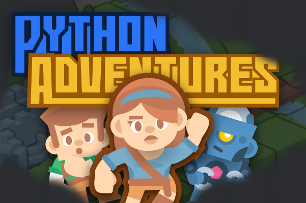

# Python Adventures

Python Adventures is a discord game bot where you learn about Python features while progressing your character through a map.

# Installation
## Discord API Token
What is a Discord API Token?
A Discord API Token is a unique identifier used to authenticate requests to the Discord API. It acts as a password for your bot, allowing it to interact with Discord's servers, join channels, send messages, and perform other actions as defined by the Discord API.

## How to Obtain a Discord API Token
1. Create a New Application:
  - Go to the [***Discord Developer Portal***](https://discord.com/developers/applications)
  -  Click on ***New Application***
  -   Give your application a name and click **Create**.

2. Create a Bot:
  - Navigate to the ***Bot*** section in the sidebar.
  -  Click on "Add Bot" and confirm by clicking ***Yes, do it!***

3. Copy the Token:
   - Under the "TOKEN" section, click "Copy" to copy your bot's token.
   - Keep this token secure and never share it publicly. If your token is exposed, you should regenerate it immediately.

For more information, Consult The [Discord Developer Portal](https://discord.com/developers/docs/intro) Documentation.

## Installation and Setup
To get your Discord bot up and running, follow these steps:
1. **Clone the repository**: `git clone github.com/gustavwilliam/cj11-mesmerizing-meteors && cd cj11-mesmerizing-meteors`

2. **Install Requirements**:
   > - You can create a virtual environment by `python -m venv .venv`
   > - Activate it by `source .venv/bin/activate` then pursue the setup

Install the dependencies using `pip install -r requirements.txt`. If you are developing the bot and not just running it, also consider installing dev requirements: `pip install -r dev-requirements.txt`.

3. **Set Up Your Environment Variables**:
   - Create a .env file in the root of your project and add your Discord API Token: `DISCORD_BOT_KEY="your-discord-token-here"`

4. **Run the Bot**: `python bot/main.py`

