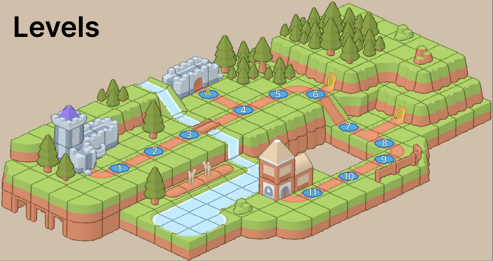
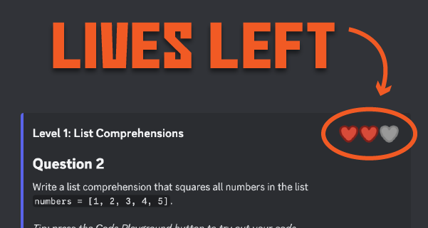
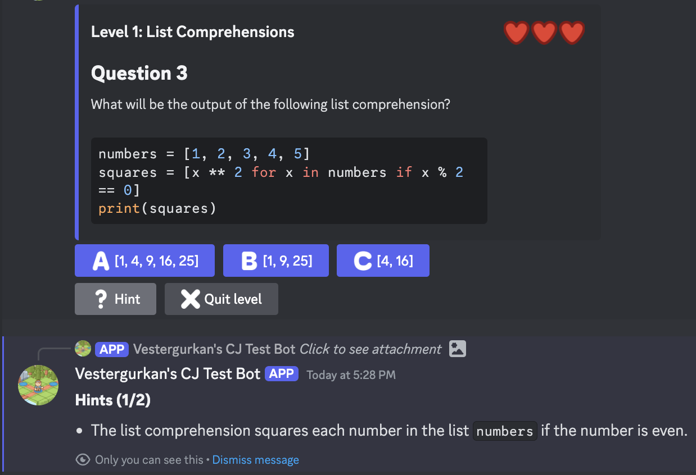
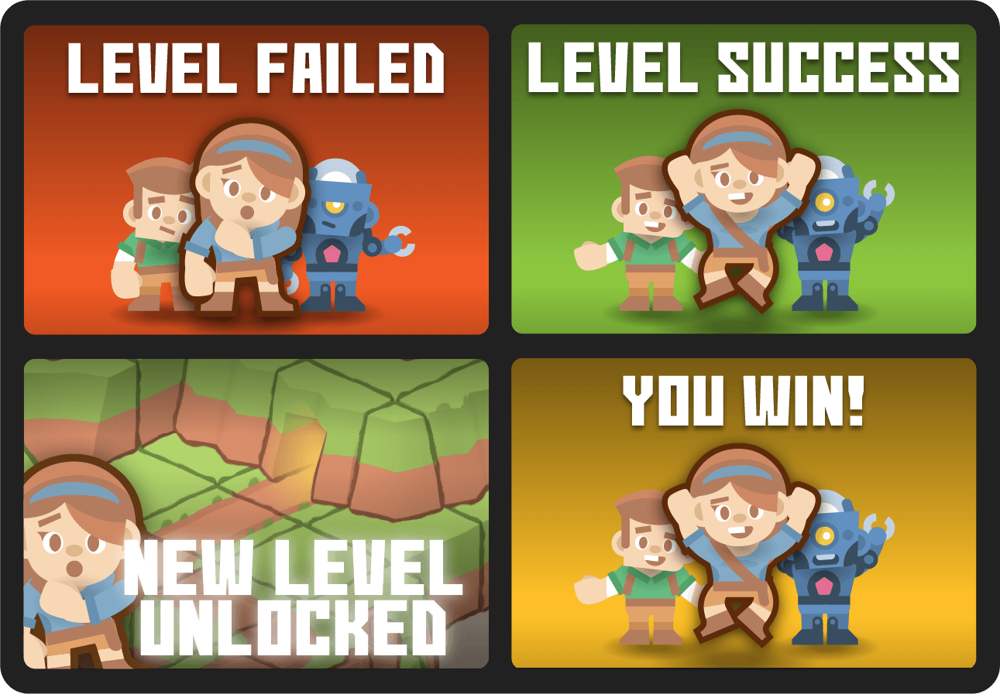
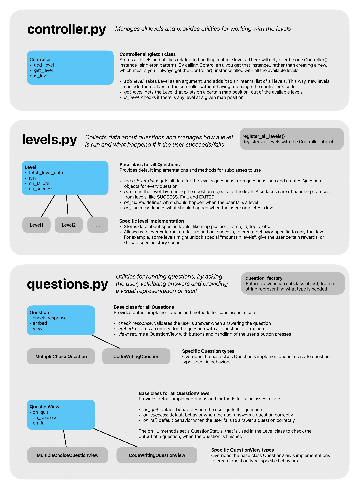

# Python Adventures

https://github.com/user-attachments/assets/8f392225-6d21-464f-9e55-bc74ca643df3

*🔈Volume on*

Python Adventures is a Discord game bot where you learn about Python features while progressing your character through a map filled with challenges and secrets!

## Table of contents
- [Python Adventures](#python-adventures)
  - [Table of contents](#table-of-contents)
  - [Theme: Information Overload](#theme-information-overload)
- [Gameplay](#gameplay)
  - [Map](#map)
    - [Navigation](#navigation)
  - [Levels](#levels)
    - [Limited lives](#limited-lives)
    - [Code evaluation](#code-evaluation)
    - [Hints](#hints)
    - [Success/defeat/win screens](#successdefeatwin-screens)
- [Software architecture](#software-architecture)
  - [Level/questions](#levelquestions)
    - [Adding a new level](#adding-a-new-level)
    - [Adding a new question type](#adding-a-new-question-type)
    - [Modifying default behavior](#modifying-default-behavior)
- [Setup instructions](#setup-instructions)
  - [Discord API Token](#discord-api-token)
  - [How to Obtain a Discord API Token](#how-to-obtain-a-discord-api-token)
  - [Discord Developer Portal Settings](#discord-developer-portal-settings)
  - [Installation and Setup](#installation-and-setup)
- [Contributions](#contributions)


## Theme: Information Overload
Python Adventures immerses players in a learning environment filled with information-rich levels. Each level combines multiple-choice questions and intricate coding challenges, demanding players process and apply vast amounts of information quickly and accurately. The special code golfing levels take this to the next level by requiring players to deal with dense, compact code — all while keeping it light and playful.

# Gameplay

Follow the main character Maria as she sets out on an epic journey to becoming a true Pythonista! The main storyline of the game consists of 11 levels, where completing one unlocks the next.

## Map



The levels 1-11 consist of both multiple-choice questions and code writing challenges, to make learning exciting and really challenge your unstanding of the topics at hand.

There are also three *special* levels A, B and C, outside of the main storyline, which tackle code golfing. If your brain doesn't get overloaded from the compact information in oneliners and hacky ways of writing code, these levels perfect for you!

### Navigation


To move between levels in Python Adventures, we have created a vibrant map that can be easily navigated using Discord's interaction buttons. The map is dynamically generated for the user, taking into account factors such as the following:
- **Unlocked levels**, including special levels
- **Completed levels**
- **Current player position**, persisted between sessions
- **Player display name**, for the name tag

In order to not clutter up the chat, navigation simply edits the original interaction response embed with the new map state. Buttons are also dynamically enabled/disabled based on whether or not an action can be taken. For example, if a tree is in the way, moving that direction will be disabled.

## Levels
### Limited lives


With three lives comes a maximum of three mistakes before you have to restart the level. This keeps the game exciting and turns the difficulty of even the multiple choice questions up a notch.

### Code evaluation
The most important part of learning to code is writing code and actually trying things yourself. Because of this, we have made code writing an integral part of the levels, providing a Code Playground to test run your code before submitting. And once submitted, we run a battery of unit tests on the code to ensure it passes the requirements.

By utilizing the [Tio.run](https://tio.run) API to evaluate code, we are able to evaluate and test user code without needing to set up a sandboxed environment and without risking malicious input causing issues for the machine running the bot.

### Hints
Sometimes you get stuck on a problem. While revealing the answer straight away won't help you much in learning, getting a hint or two in the right direction can be a game changer. We have provided hints for all questions that can be accessed one at a time by pressing the **Hint** button:



### Success/defeat/win screens


With vibrant success/fail messages depending on how a level went for the player, we hope to keep the player engaged and excited to move toward the next goal. The images above are some of these and are displayed in the following situations:
- **Level failed**: the user fails a level
- **Level success**: the user completes a level
- **New level unlocked**: displayed after "level success" when the B or C level is unlocked
- **You win**: displayed when completing the final level of the game (level C) together with a message from the developers :)

# Software architecture

In order to create a game that is easy to maintain and simple to add new features to without breaking existing ones, we have put a lot of effort into designing a software architecture for the game that will allow precisely that.

## Level/questions

Here is a diagram that explains the general level-question software architecture:



### Adding a new level

This is how a new level is added:
- Subclass `Level` and set the desired attributes
- Adding `Level.register()` in the `register_all_levels()` function
- Add the level's questions in `questions.json`

The new level is now accessible and ready to be used anywhere in the bot through the `Controller` class! The map description, buttons and functionality at the provided coordinte will automatically match what was provided in the `Level` class. Better yet, all questions in `questions.json` will be automatically parsed, loaded, and ready to be used.

### Adding a new question type

At one point while developing the game, we decided to add a code golf class. In a few minutes, the class was ready to go! By subclassing `WriteCodeQuestion` (which itself is a subclass of `Question`), the code golf question type got all the code execution, unit test and normal "question" logic from the `WriteCodeQuestion` and `Question` classes.

This is how a new question type is added:
- Subclass `Question` and set the desired attributes
- *Optional*: overwrite functions for question parsing, running, on_success, on_fail and other methods
- Add the question type to `Question.view`
- Add the question type to `question_factory`

Your question type is now fully supported by the bot and questions of the type can be added to `questions.json`!

### Modifying default behavior

One major feature of the software architecture at hand, is the ability to extend and overwrite default functionality in question types and levels without touching the base classes. Here are a few of the supported overwrites:

**Question**
- `check_response`: logic to check if a given answer is correct
- `get_embed_description` and `embed`: customize the embed send for the question

**QuestionView**
- `on_quit`: called when the user presses "Quit"
- `on_success`: called when the user succeeds with a question
- `on_fail`: called when the user answers a question incorrectly

**Level**
- `run`: asks the user questions, displays status screen when level is over and then returns the user to the map
- `on_failure`: called when the user fails a level
- `on_success`: called when the user completes a level
- `_success_page` and `_success_more_pages`: used to customize the embeds being sent when the user completes the level, for presenting newly unlocked levels or win screens

These customization options have been crucial for the following and more: showing a quickguide about lives before the first level, unlocking special levels at the right times and customizing the success screens of levels to showcase the current status. In the future, these features would also be great for integrating more story into the game or giving the player certain rewards for completing levels, questions or other tasks.

# Setup instructions
## Discord API Token
What is a Discord API Token?
A Discord API Token is a unique identifier used to authenticate requests to the Discord API. It acts as a password for your bot, allowing it to interact with Discord's servers, join channels, send messages, and perform other actions as defined by the Discord API.

## How to Obtain a Discord API Token
1. Create a New Application:
  - Go to the [***Discord Developer Portal***](https://discord.com/developers/applications)
  -  Click on ***New Application***
  -   Give your application a name and click **Create**.

2. Create a Bot:
  - Navigate to the ***Bot*** section in the sidebar.
  -  Click on "Add Bot" and confirm by clicking ***Yes, do it!***

3. Copy the Token:
   - Under the "TOKEN" section, click "Copy" to copy your bot's token.
   - Keep this token secure and never share it publicly. If your token is exposed, you should regenerate it immediately.

## Discord Developer Portal Settings

1. Log in to **[Discord Developer Portal](https://discord.com/developers/)**
2. Create your new project with the ``New Application`` button.
3. Activate the ``PRESENCE INTENT``, ``SERVER MEMBERS INTENT``, ``MESSAGE CONTENT INTENT`` in the ``Bot > Privileged Gateway Intents`` section.
4. After creating your project, make the necessary settings in the ``Settings > OAuth2`` tab.
   - Select the ``bot`` option from the OAuth2 URL Generator section
   - Below, select the permissions you wish for the bot to have in the server. We recommend `Administrator` for testing purposes
5. After clicking on the ``bot``, you can choose the permissions your bot will have from the window that opens.

      **Recommended settings:**
      ````
      Bot > General Permissions
         - Manage Expressions
         - Create Expressions
         - View Channels
         - View Server Insights

      Bot > Text Permissions
         - Send Messages
         - Manage Messages
         - Embed Links
         - Attach Files
         - Use External Emojis
         - Use External Stickers
         - Add Reactions
         - Use Slash Commands
         - Use Embeded activites
         - Create Polls
      ````
   - Depending on the options you set, you can add your bot to your server by opening the ``GENERATED URL`` in your browser, authenticating with discord, and adding it to a server of your choosing.
   - Make sure you give your bot enough room to play.


## Installation and Setup
To get your Discord bot up and running, follow these steps:
1. **Clone the repository**: `git clone https://github.com/gustavwilliam/cj11-mesmerizing-meteors.git && cd cj11-mesmerizing-meteors`

2. **Install Requirements**:
   > - You can create a virtual environment by `python -m venv .venv`
   > - Activate it by `source .venv/bin/activate` then pursue the setup

Install the dependencies using `pip install -r requirements.txt`. If you are developing the bot and not just running it, also consider installing dev requirements: `pip install -r dev-requirements.txt`.

3. **Set Up Your Environment Variables**:
   - Create a .env file in the root of your project and add your Discord API Token: `DISCORD_BOT_KEY="your-discord-token-here"`

4. **Update Emoji Config**:
   - Under `bot/assets/icons` you will find all the required emojis for the bot
   - Add all these emojis to a server that your bot will be invited to
   - Copy the ID of every emoji (send the custom emoji in a Discord channel and add `\` before it to see the ID. It will look something like this: `<:arrowright:1265077270515552339>`
   - Update the IDs of every emoji in `bot/config.py`

5. **Run the Bot**: `python bot/main.py`

# Contributions

This is a rough overview of what each team member has contributed:
- @gustavwilliam: graphics, map functionality and question+level classes
- @Noble-47: database functionality
- @jspmic: level questions, documentation and a (sadly not merged in time) help command
- @HeavenMercy: game intro video in this readme, linting and dotenv usage
- @Deja-Vu1: basic bot setup and discord developer portal instructions

Furthermore, each team member has contributed with valuable ideas and feedback throughout the development process.
